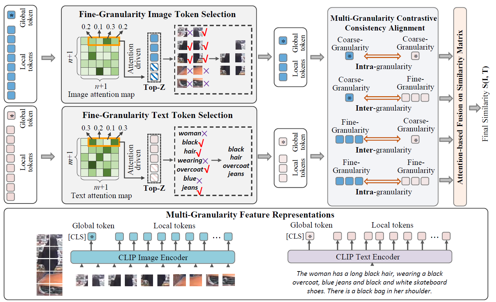

# 【AAAI 2024 】Text-based Occluded Person Re-identification via Multi-Granularity Contrastive Consistency Learning

This repository offers the official implementation of [MGCC](https://ojs.aaai.org/index.php/AAAI/article/view/28433) in PyTorch.

## Overview




## Requirements

*   [PyTorch](https://pytorch.org/ "PyTorch") version = 1.7.1

*   Install other libraries via

```bash
pip install -r requirements.txt
```
## Data preparation

*  **CUHK-PEDES**

    Download the CUHK-PEDES dataset from [here](https://github.com/ShuangLI59/Person-Search-with-Natural-Language-Description) 
    
    Organize them in `./dataset/CUHK-PEDES/` folder as follows:
    ~~~
    |-- dataset/
    |   |-- CUHK-PEDES/
    |       |-- imgs
                |-- cam_a
                |-- cam_b
                |-- ...
    |       |-- reid_raw.json
    |-- others/
    ~~~

*  **ICFG-PEDES**

    Download the ICFG-PEDES dataset from [here](https://github.com/zifyloo/SSAN)   

    Organize them in `./dataset/ICFG-PEDES/` folder as follows:

    ~~~
    |-- dataset/
    |   |-- ICFG-PEDES/
    |       |-- imgs
                |-- test
                |-- train 
    |       |-- ICFG-PEDES.json
    |-- others/
    ~~~

*  **RSTPReid**

    Download the RSTPReid dataset from [here](https://github.com/njtechcvlab/rstpreid-dataset)   

    Organize them in `./dataset/RSTPReid/` folder as follows:

    ~~~
    |-- dataset/
    |   |-- RSTPReid/
    |       |-- imgs
    |       |-- data_captions.json
    |-- others/
    ~~~

* **Occlusion Instance Augmentation**

  After changing the parameters of `parse_args` fuction in `process_data.py` according to different datasets, run the `process_data.py` in the `dataset` folder.

## How to Run

* **About the pretrained CLIP and Bert checkpoints**

  Download the pretrained CLIP checkpoints from [here](https://huggingface.co/openai/clip-vit-base-patch32) and save it in path `./src/pretrain/clip-vit-base-patch32/`

  Download the pretrained Bert checkpoints from [here](https://huggingface.co/bert-base-uncased) and save it in path `./src/pretrain/bert-base-uncased/`

* **About the running scripts**

  Use CUHK-PEDES as examples:
  ```
  sh experiment/CUHK-PEDES/train.sh
  ```
  After training done, you can test your model by run:
    ```
    sh experiment/CUHK-PEDES/test.sh
    ```
  As for the usage of different parameters, you can refer to `src/option/options.py` for the detailed meaning of each parameter.
  
## Citation

If you find our method useful in your work, please consider staring 🌟 this repo and citing 📑 our paper:
```
@inproceedings{wu2024text,
  title={Text-based Occluded Person Re-identification via Multi-Granularity Contrastive Consistency Learning},
  author={Wu, Xinyi and Ma, Wentao and Guo, Dan and Zhou, Tongqing and Zhao, Shan and Cai, Zhiping},
  booktitle={Proceedings of the AAAI Conference on Artificial Intelligence},
  volume={38},
  number={6},
  pages={6162--6170},
  year={2024}
}
```
## Acknowledgments

The implementation of our paper relies on resources from [SSAN](https://github.com/zifyloo/SSAN), [CLIP](https://github.com/openai/CLIP) and [XCLIP](https://github.com/xuguohai/X-CLIP). We thank the original authors for their open-sourcing.
